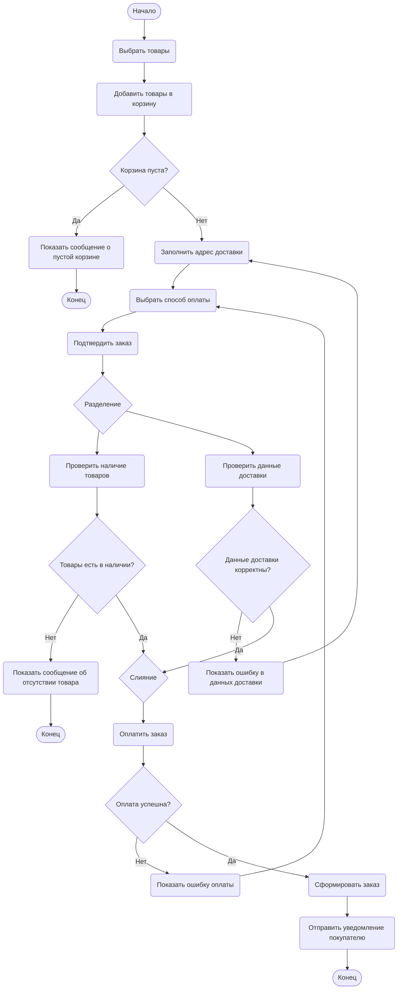

# Диаграмма деятельности: Процесс оформления заказа в интернет-магазине

## Описание процесса

Процесс оформления заказа в интернет-магазине начинается с выбора товаров покупателем. После добавления товаров в корзину система проверяет, не пуста ли корзина. Затем покупатель вводит адрес доставки и выбирает способ оплаты. После подтверждения заказа система параллельно проверяет наличие товаров на складе и корректность данных доставки. Если данные подтверждены, покупатель выполняет оплату. При успешной оплате система формирует заказ, отправляет уведомление покупателю и завершает процесс. Если на каком-либо этапе возникает ошибка, пользователь получает соответствующее сообщение, после чего процесс завершается.

## Диаграмма

## Описание ключевых шагов

1. **Выбрать товары** - покупатель просматривает каталог интернет-магазина и выбирает нужные товары.
2. **Добавить товары в корзину** - выбранные товары помещаются в корзину для дальнейшего оформления.
3. **Проверить корзину** - система проверяет, есть ли товары в корзине.
4. **Заполнить адрес доставки** - покупатель вводит данные для доставки заказа.
5. **Выбрать способ оплаты** - покупатель выбирает удобный вариант оплаты.
6. **Подтвердить заказ** - покупатель подтверждает состав заказа, адрес и способ оплаты.
7. **Проверить наличие товаров** - система проверяет, доступны ли выбранные товары на складе.
8. **Проверить данные доставки** - система проверяет корректность введённого адреса.
9. **Оплатить заказ** - покупатель выполняет оплату выбранным способом.
10. **Сформировать заказ** - система создаёт заказ после успешной оплаты.
11. **Отправить уведомление покупателю** - система уведомляет покупателя об успешном оформлении заказа.

## Пояснения к ветвлениям

- **Корзина пуста?**
  - Если да, система показывает сообщение о пустой корзине, и процесс завершается.
  - Если нет, покупатель переходит к заполнению адреса доставки.

- **Товары есть в наличии?**
  - Если да, процесс продолжается к слиянию параллельных потоков.
  - Если нет, система показывает сообщение об отсутствии товара, и процесс завершается.

- **Данные доставки корректны?**
  - Если да, процесс продолжается к слиянию параллельных потоков.
  - Если нет, система показывает ошибку, и покупатель возвращается к заполнению адреса доставки.

- **Оплата успешна?**
  - Если да, система формирует заказ и отправляет уведомление покупателю.
  - Если нет, система показывает ошибку оплаты, и покупатель возвращается к выбору способа оплаты.

## Пояснения к параллельным ветвям

После подтверждения заказа выполняется разделение процесса на две параллельные ветви:

- **Проверить наличие товаров** – система проверяет, доступны ли выбранные товары на складе.
- **Проверить данные доставки** – система проверяет корректность адреса доставки.

После успешного завершения обеих проверок потоки соединяются в узле **Слияние**, и процесс продолжается оплатой заказа. Такое построение показывает, что проверка наличия товаров и проверка данных доставки могут выполняться независимо друг от друга.

## Источники

- Практическая работа № 15 «Диаграмма деятельности (Activity Diagram)».
- Материалы практической работы по синтаксису Mermaid для построения диаграмм деятельности.
- Требования к диаграмме деятельности из практической части работы.

## Контрольные вопросы

1. Что такое диаграмма деятельности и для чего она используется? - Диаграмма деятельности - это UML-диаграмма, которая используется для моделирования динамических аспектов системы. Она показывает последовательность действий, условия ветвления, параллельные потоки и синхронизацию. Диаграмма деятельности применяется для визуализации алгоритмов, бизнес-процессов и рабочих потоков.

2. Чем диаграмма деятельности отличается от блок-схемы? - Диаграмма деятельности похожа на блок-схему, но имеет более широкий смысл. Блок-схема обычно показывает алгоритм в виде шагов и условий, а диаграмма деятельности может дополнительно отображать параллельные потоки, синхронизацию и распределение ответственности между участниками процесса.

3. Как обозначается начальный узел в Mermaid? - Начальный узел в Mermaid можно обозначить как `([*])`, но также допускается использовать отдельный узел с текстом, например `Start([Начало])`.

4. Как обозначается узел решения (ветвление)? - Узел решения в Mermaid обозначается фигурными скобками, например `CheckCart{Корзина пуста?}`. На выходящих стрелках указываются условия ветвления, например `Да` и `Нет`.

5. Как в Mermaid реализовать параллельные ветви (fork/join)? - В Mermaid параллельные ветви можно реализовать с помощью узла разделения, от которого выходят несколько стрелок к разным действиям. Для последующего объединения используется узел слияния или соединения, к которому сходятся эти потоки.

6. Зачем нужны узлы слияния (merge) и соединители (join)? - Узел слияния нужен для объединения альтернативных потоков после ветвления без синхронизации. Соединитель join нужен для синхронизации параллельных потоков: дальнейшее выполнение начинается только после завершения всех входящих ветвей.

7. Какие правила именования действий вы знаете? - Действия нужно называть глаголами или глагольными словосочетаниями, которые ясно показывают выполняемый шаг процесса, например «Выбрать товары», «Проверить наличие товаров», «Оплатить заказ».

8. Можно ли на одной диаграмме деятельности иметь несколько конечных узлов? - Да, на одной диаграмме деятельности можно иметь несколько конечных узлов, если процесс может завершаться по разным сценариям, например при успешном оформлении заказа, пустой корзине или отсутствии товара.