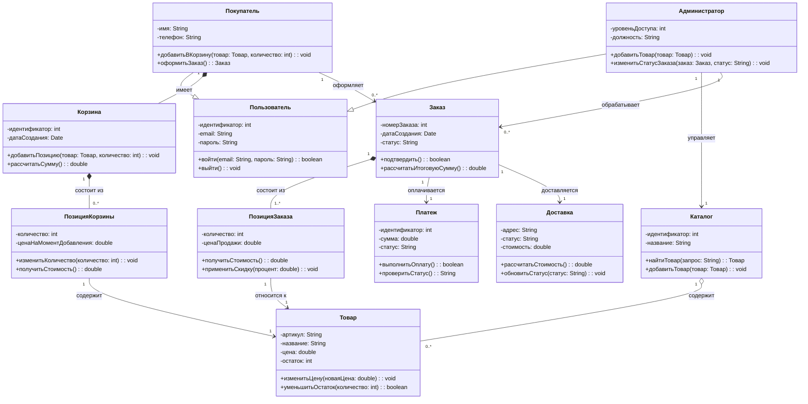

# Диаграмма классов: Интернет-магазин

## Описание предметной области

Интернет-магазин представляет собой систему, предназначенную для поиска товаров, добавления их в корзину, оформления заказа, оплаты и организации доставки. Покупатель выбирает товары, формирует корзину и оформляет заказ. Администратор управляет каталогом товаров и заказами. Заказ состоит из позиций заказа, связан с оплатой и доставкой. Каталог содержит товары, которые могут добавляться в корзину и использоваться при формировании заказа.

Основные классы системы:

- **Пользователь** - общий класс для пользователей интернет-магазина.
- **Покупатель** - пользователь, который выбирает товары, оформляет и оплачивает заказы.
- **Администратор** - пользователь, который управляет каталогом и заказами.
- **Товар** - единица продукции, доступная для покупки.
- **Каталог** - набор товаров интернет-магазина.
- **Корзина** - временное хранилище выбранных покупателем товаров.
- **ПозицияКорзины** - отдельная строка корзины с товаром и количеством.
- **Заказ** - оформленная покупка покупателя.
- **ПозицияЗаказа** - отдельная строка заказа с товаром, количеством и ценой.
- **Платеж** - информация об оплате заказа.
- **Доставка** - информация о доставке заказа.

## Диаграмма

## Список классов и их роль

- **Пользователь** - базовый класс, содержащий общие данные и действия для всех пользователей системы.
- **Покупатель** - наследуется от класса «Пользователь» и отвечает за действия клиента интернет-магазина: добавление товаров в корзину и оформление заказа.
- **Администратор** - наследуется от класса «Пользователь» и отвечает за управление каталогом и заказами.
- **Товар** - описывает товар интернет-магазина: артикул, название, цену и остаток на складе.
- **Каталог** - объединяет товары и предоставляет возможность поиска и добавления товаров.
- **Корзина** - принадлежит покупателю и хранит выбранные товары до оформления заказа.
- **ПозицияКорзины** - описывает конкретный товар в корзине, его количество и стоимость.
- **Заказ** - создаётся покупателем после подтверждения корзины и содержит информацию о покупке.
- **ПозицияЗаказа** - часть заказа, содержащая товар, количество и цену продажи.
- **Платеж** - хранит данные об оплате заказа и позволяет выполнить оплату.
- **Доставка** - хранит адрес, статус и стоимость доставки заказа.

## Описание ключевых отношений

- **Наследование** используется между классами **Покупатель**, **Администратор** и базовым классом **Пользователь**. Покупатель и администратор являются разновидностями пользователя, поэтому наследуют его общие атрибуты и методы.
- **Агрегация** используется между классами **Каталог** и **Товар**. Каталог содержит товары, но товар как сущность может существовать независимо от конкретного каталога.
- **Композиция** используется между классами **Покупатель** и **Корзина**, **Корзина** и **ПозицияКорзины**, **Заказ** и **ПозицияЗаказа**. Эти части зависят от целого: позиции корзины не имеют смысла без корзины, а позиции заказа не существуют отдельно от заказа.
- **Ассоциация** используется между покупателем и заказами, заказом и оплатой, заказом и доставкой, администратором и каталогом. Эти связи показывают устойчивое взаимодействие между объектами.
- **Множественность** показывает количество связанных объектов. Например, один покупатель может оформить много заказов, один заказ состоит из одной или нескольких позиций, а один каталог может содержать много товаров.

## Объяснение выбранных типов связей

- Связь **Покупатель --|> Пользователь** выбрана как наследование, потому что покупатель является пользователем системы.
- Связь **Администратор --|> Пользователь** выбрана как наследование, потому что администратор также является пользователем, но имеет дополнительные права.
- Связь **Каталог o-- Товар** выбрана как агрегация, потому что товары входят в каталог, но могут существовать как самостоятельные объекты.
- Связь **Корзина *-- ПозицияКорзины** выбрана как композиция, потому что позиция корзины не существует без самой корзины.
- Связь **Заказ *-- ПозицияЗаказа** выбрана как композиция, потому что позиция заказа является частью конкретного заказа.
- Связь **Покупатель --> Заказ** выбрана как ассоциация с множественностью, потому что один покупатель может оформить несколько заказов.
- Связи **Заказ --> Платеж** и **Заказ --> Доставка** выбраны как ассоциации, потому что заказ связан с оплатой и доставкой.

## Контрольные вопросы

1. Что такое диаграмма классов и для чего она используется? - Диаграмма классов - это диаграмма UML, которая описывает статическую структуру системы: классы, их атрибуты, методы и отношения между ними. Она используется для проектирования архитектуры системы, документирования структуры классов и подготовки к последующей реализации в коде.

2. Какие три основные секции имеет прямоугольник класса? - Прямоугольник класса имеет три основные секции: имя класса, атрибуты класса и методы класса.

3. Что означают символы `+`, `-`, `#` перед атрибутами и методами? - Символ `+` означает public, то есть открытый доступ. Символ `-` означает private, то есть закрытый доступ. Символ `#` означает protected, то есть защищённый доступ.

4. Как в Mermaid обозначается наследование? - Наследование в Mermaid обозначается стрелкой `--|>`, направленной от класса-потомка к родительскому классу. Например: `Покупатель --|> Пользователь`.

5. В чём разница между агрегацией и композицией? - Агрегация обозначает отношение «часть-целое», при котором части могут существовать независимо от целого. Композиция является более жёсткой связью: часть не может существовать без целого, и её жизненный цикл зависит от него.

6. Как указать множественность отношения (например, «один ко многим»)? - Множественность отношения указывается рядом с концами связи в кавычках. Например, связь «один ко многим» можно записать так: `Покупатель "1" --> "0..*" Заказ`.

7. Как изобразить интерфейс в Mermaid? - Интерфейс в Mermaid можно изобразить как класс со стереотипом `<<interface>>`. Например, внутри класса указывается строка `<<interface>>`, а затем перечисляются методы интерфейса.

8. Какую информацию можно указать в сигнатуре метода? - В сигнатуре метода можно указать видимость, имя метода, параметры с типами и возвращаемый тип. Например: `+добавитьТовар(товар: Товар): void`.