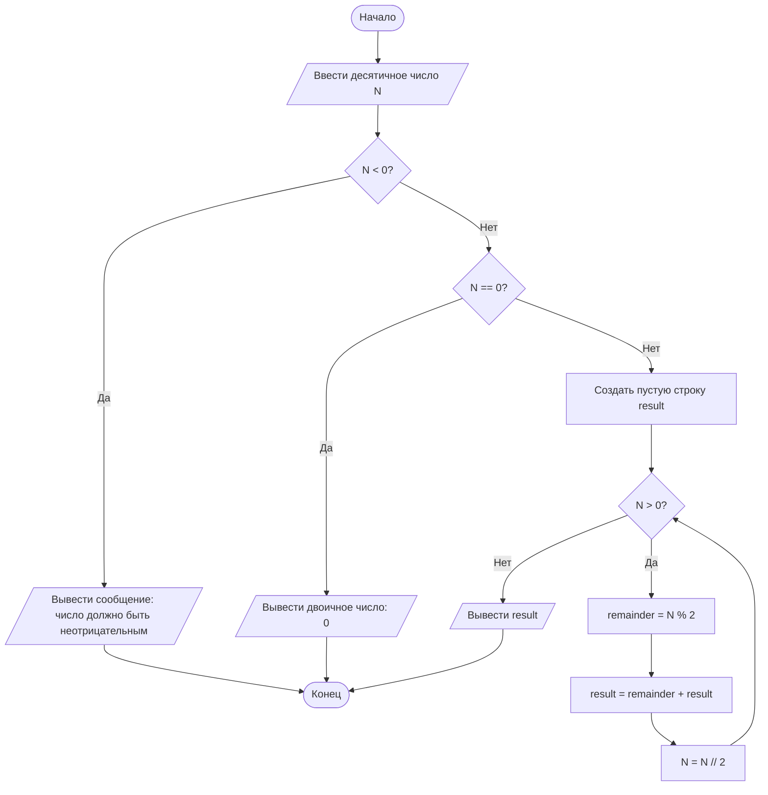

# Блок-схема алгоритма перевода числа из десятичной системы в двоичную

  

**Описание алгоритма:**  

Алгоритм переводит целое неотрицательное число из десятичной системы счисления в двоичную. На вход подаётся число `N`. Если `N = 0`, результатом будет `0`. Если `N > 0`, алгоритм последовательно делит число на 2, записывает остатки от деления в начало строки результата и продолжает работу, пока число не станет равным 0. На выходе получается двоичная запись исходного числа.

  

## Диаграмма

  



  

## Пояснение шагов алгоритма

  

1. Начать выполнение алгоритма.

2. Ввести десятичное число `N`.

3. Проверить, является ли число отрицательным.

4. Если число отрицательное, вывести сообщение об ошибке и завершить алгоритм.

5. Если `N = 0`, сразу вывести `0`.

6. Если `N > 0`, создать пустую строку `result`.

7. Пока `N > 0`, вычислять остаток от деления на 2.

8. Добавлять остаток в начало строки `result`.

9. Делить `N` на 2 без остатка.

10. После завершения цикла вывести полученную двоичную запись.

11. Завершить алгоритм.

  

## Контрольные вопросы

  

**1. Что такое Mermaid и для чего он используется?**  

Mermaid - это язык разметки для создания диаграмм и схем в текстовом виде. Он используется для построения блок-схем, диаграмм последовательности, классов, состояний, ER-диаграмм, диаграмм Ганта и других схем прямо внутри Markdown-документов.

  

**2. Как вставить диаграмму в Markdown-документ?**  

Диаграмма вставляется в Markdown с помощью блока кода с указанием языка `mermaid`:

  

````markdown


````

  

**3. Какие типы узлов (фигур) доступны в блок-схемах Mermaid?**  

В Mermaid доступны разные формы узлов: прямоугольник для процесса, прямоугольник со скруглёнными углами, ромб для условия, овал или скруглённый блок для начала и конца, параллелограмм для ввода/вывода, цилиндр для данных и круг для соединителя.

  

**4. Чем отличаются стрелки `-->` и `-- текст -->`?**  

Стрелка `-->` показывает обычный переход от одного узла к другому. Стрелка `-- текст -->` тоже показывает переход, но дополнительно содержит подпись, например `Да` или `Нет`.

  

**5. Как изменить ориентацию диаграммы с вертикальной на горизонтальную?**  

Нужно изменить направление диаграммы. Например, вместо `flowchart TD` указать `flowchart LR`, тогда схема будет строиться слева направо.

  

**6. Зачем нужны подграфы `subgraph`?**  

Подграфы нужны для группировки связанных узлов внутри одной диаграммы. Это удобно, когда алгоритм большой и его нужно разделить на логические части.

  

**7. Какие символы нельзя использовать в идентификаторах узлов?**  

В идентификаторах узлов нельзя использовать пробелы. Лучше применять латинские буквы, цифры и понятные имена без специальных символов.

  

**8. Почему важно указывать начальный и конечный узлы?**  

Начальный и конечный узлы показывают, где алгоритм начинается и где завершается. Благодаря этому блок-схема становится понятной и логически завершённой.